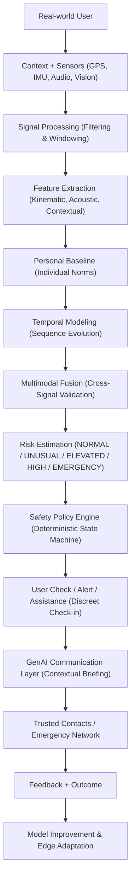

# WEGOTCHU

### *Go. Glow. We gotchu.*

**AI-powered proactive personal safety intelligence system using multimodal ML, GenAI, contextual signals, and real-time risk estimation.**

---

> [!IMPORTANT]
> **Responsible AI & Safety Disclaimer**  
> WEGOTCHU is an academic research project and startup prototype engineered for **risk estimation, anomaly detection, and proactive decision support**. WEGOTCHU does **not** guarantee personal safety, predict criminal events, or replace official emergency dispatch authorities (such as 911/112). All risk levels represent probabilistic estimation states to assist users and trusted contacts.

---

## 1. The Problem: The Flaw in Traditional SOS Apps

Traditional personal safety applications suffer from a fundamental architectural limitation: they are **purely reactive**.

1. **High Cognitive & Physical Burden Under Duress:** When an individual faces intimidation, sudden medical shock, incapacitation, or coercion, reaching into a pocket, unlocking a smartphone, and triggering an SOS button is frequently impossible.
2. **Binary Perception:** Existing tools treat safety as a binary toggle: either everything is completely safe, or a full-scale crisis has already occurred.
3. **Alert Fatigue & Inaccuracy:** Rule-based alarms trigger frequent false alarms (e.g., dropping a phone or jogging), causing users to disable the app.
4. **Intrusive vs. Neglectful Trade-off:** Apps either broadcast continuous location without discretion (compromising privacy) or do nothing until an emergency has already escalated.

---

## 2. The Core Idea: Proactive Safety Intelligence

WEGOTCHU redefines personal safety by shifting from **reactive alerting** to **proactive contextual intelligence**.

Rather than waiting for a crisis to unfold, WEGOTCHU continuously computes a lightweight, privacy-preserving **risk estimation** by evaluating:
* **Contextual Signals:** Route deviation, velocity changes, ambient noise levels, lighting transitions, and temporal context.
* **Personalized Behavioral Baselines:** Learning what is "normal" for an individual user (e.g., typical commute corridors, walking cadence, active hours) to suppress false positives.
* **Temporal Machine Learning:** Modeling how situations evolve over time rather than evaluating isolated, instantaneous sensor spikes.
* **Multimodal Fusion:** Cross-verifying signals across motion, geospatial, and acoustic intelligence.
* **Calibrated Risk Engine & Policy Engine:** A deterministic state machine that initiates discreet check-ins before escalation.
* **GenAI Communication Layer:** Generating concise, empathetic, and context-rich status briefings for trusted contacts if a check-in is unacknowledged.

---

## 3. Traditional SOS vs. WEGOTCHU

| Capability | Traditional SOS Apps | WEGOTCHU Proactive Intelligence |
| :--- | :--- | :--- |
| **Trigger Mechanism** | Manual panic button or static fall threshold | Automated contextual anomaly detection + Manual SOS bypass |
| **Intelligence Model** | Static if-else rules | Multimodal ML + Temporal sequence modeling |
| **Personalization** | Population-level static thresholds | Learned individualized behavioral baselines |
| **Intervention Strategy** | Immediate siren or 911 dispatch | Graduated intervention (Discreet Check-in → Pre-alert → Escalation) |
| **False Alarm Control** | Very low (causes alert fatigue) | High (suppressed via baseline & multi-signal verification) |
| **Communication** | Generic automated SMS ("Help me!") | GenAI-synthesized contextual briefing with location & timeline |
| **Privacy Paradigm** | Continuous cloud tracking | On-device edge inference; ephemeral raw buffers |
| **LLM Responsibility** | None or unconstrained chatbot | Strictly constrained to communication; **never** decides danger |

---

## 4. System Architecture

WEGOTCHU processes telemetry through a strictly layered, feed-forward architecture:

See [docs/architecture/system-architecture.md](docs/architecture/system-architecture.md) for full architectural documentation.

---

## 5. Major AI Components

WEGOTCHU enforces a strict separation of concerns across the intelligence pipeline:

1. **Perception & Signal Processing (`perception/`):** Edge-optimized feature extractors for motion kinematics, environmental acoustic distress scores, and scene illumination context.
2. **Anomaly Detection (`ai/anomaly_detection/`):** Unsupervised and semi-supervised models identifying statistical departures from normal mobility.
3. **Personal Baseline (`ai/personalization/`):** Individualized models accounting for user-specific habits, walking speeds, and regular routes.
4. **Temporal Modeling (`ai/temporal_model/`):** Sequence networks (TCN / GRU / Transformers) capturing temporal persistence to filter transient spikes.
5. **Multimodal Fusion (`ai/multimodal_fusion/`):** Cross-modal validation combining motion, audio, and geospatial indicators.
6. **Risk Engine (`ai/risk_engine/`):** Calibrated continuous risk scoring outputting standardized states: `NORMAL`, `UNUSUAL`, `ELEVATED`, `HIGH`, `EMERGENCY`.
7. **Safety Policy Engine:** Purely deterministic policy logic governing escalation timing and actions.
8. **GenAI Communication Layer (`ai/genai/`):** Structured LLM integration that synthesizes user status updates without ever altering or overriding safety states.

---

## 6. Technology Stack

* **AI/ML & Research:** Python 3.11+, PyTorch, scikit-learn, NumPy, Pandas, SciPy.
* **Audio Intelligence:** Torchaudio, Librosa.
* **Computer Vision & Edge:** OpenCV (headless), MediaPipe, ONNX Runtime, LiteRT / TFLite.
* **Backend Services:** FastAPI, PostgreSQL, Pydantic v2, Uvicorn, Docker.
* **Mobile Application:** Android (Kotlin), Jetpack Compose, Android Sensor APIs.
* **Generative AI:** LLM Gateway with Structured Outputs (JSON Schema enforcement) and deterministic safety guardrails.
* **Quality Assurance:** Pytest, Flake8, Black, GitHub Actions CI.

---

## 7. Team Structure & Responsibilities

| Role | Member | Primary Ownership |
| :--- | :--- | :--- |
| **Project Lead** | Lead AI/ML & GenAI | Overall AI architecture, ML models, temporal modeling, multimodal fusion, risk engine, GenAI guardrails, research direction. |
| **Member 2** | Data Science & Data Engineering Lead | Dataset curation, data ingestion pipelines, feature engineering, exploratory data analysis, dataset documentation, data quality. |
| **Member 3** | Mobile & Backend Engineer | Android/Kotlin client, onboarding, Safety Mode, manual SOS, sensor data collection, backend FastAPI, database, security. |
| **Member 4** | CV, Audio & Edge AI Lead | Audio preprocessing, acoustic ML, computer vision context, lightweight model quantization, ONNX/LiteRT edge inference, battery optimization. |

Detailed assignments are documented in [docs/project/team-responsibilities.md](docs/project/team-responsibilities.md).

---

## 8. Development Status & 8-Month Roadmap

WEGOTCHU is currently in **Month 1: Foundation, Architecture, & Scaffolding**.

* **Month 1:** Research, requirements, threat modeling, privacy design, repository scaffolding. *(Current)*
* **Month 2:** Dataset research, ingestion pipelines, controlled scenarios, baseline models.
* **Month 3:** Motion/context pipeline, kinematic anomaly detection, initial risk model.
* **Month 4:** Personal baseline modeling, temporal sequence experiments, evaluation framework.
* **Month 5:** Android MVP, sensor streaming, safety mode, policy engine.
* **Month 6:** GenAI communication layer, end-to-end integration, security auditing.
* **Month 7:** Controlled experimental evaluation, ablation studies, error analysis.
* **Month 8:** Final prototype, research publication, project defense, startup pitch.

### MVP Priorities
* **P0 (Critical Path):** Android App, Manual SOS, Trusted Contacts, Safety Timer, GPS/IMU streaming, Rule-based & ML baseline risk engine, Discreet Check-in.
* **P1 (Core Intelligence):** Personal baseline adaptation, Temporal modeling, Audio distress perception, GenAI status synthesis.
* **P2 (Advanced Horizon):** Computer vision context, Smartwatch integration, Advanced on-device quantization, Federated learning.

See [docs/project/roadmap.md](docs/project/roadmap.md) and [docs/project/milestones.md](docs/project/milestones.md).

---

## 9. Safety & Privacy Principles

1. **No Absolute Safety Claims:** The system provides probabilistic risk estimation and decision support.
2. **Inviolable Manual SOS:** The user can trigger emergency SOS at any time, instantly bypassing all AI pipelines.
3. **Privacy by Design & Data Minimization:** Raw audio and camera feeds are processed in ephemeral in-memory buffers on-device and never continuously saved.
4. **No Covert Surveillance:** WEGOTCHU does not perform unauthorized facial recognition or hidden surveillance.
5. **Deterministic Safety Primacy:** The GenAI layer is strictly isolated from risk classification and cannot alter safety policies.
6. **Zero Secrets in Source Control:** No API keys, credentials, or private participant datasets are committed to GitHub.

Read our complete policy in [docs/safety/ai-safety-policy.md](docs/safety/ai-safety-policy.md) and [docs/safety/privacy.md](docs/safety/privacy.md).

---

## 10. Research Direction

Our primary research inquiry investigates:

> *"Can personalized temporal multimodal AI improve proactive personal safety-risk estimation compared with isolated or non-personalized models?"*

We formulate rigorous hypotheses, benchmarks against classical baselines, and evaluate on calibrated metrics (Precision, Recall, F1, FPR, FNR, PR-AUC, Inference Latency, and Battery Consumption).

Read the full research plan in [docs/research/research-question.md](docs/research/research-question.md).

---

## 11. Contribution Workflow

All contributors follow standard GitHub engineering hygiene:
1. Never push directly to `main`.
2. Branch naming: `feature/<name>`, `fix/<name>`, `research/<name>`, `docs/<name>`.
3. Follow Conventional Commits (`feat:`, `fix:`, `docs:`, `research:`).
4. Require at least one peer code review prior to merging.

Read the detailed guide in [CONTRIBUTING.md](CONTRIBUTING.md).
