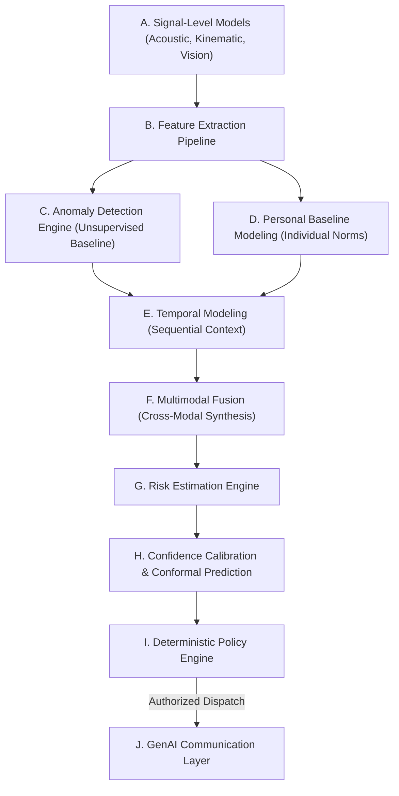

# WEGOTCHU: AI & Machine Learning Architecture

## 1. AI Stack Specification (Layers A through J)

WEGOTCHU employs a hierarchical AI architecture designed for statistical robustness, calibrated risk scoring, and privacy-preserving execution.



---

### Layer A: Signal-Level Models
Specialized, lightweight acoustic and kinematic models running close to sensor hardware:
* **Audio Keyword & Distress Classifier:** Lightweight 1D-CNN or MobileNet-v3 trained on acoustic distress benchmarks (screams, calls for help, sudden impacts).
* **Kinematic State Classifier:** Micro-classifier distinguishing stationary, walking, running, cycling, and vehicular transit.
* **Ambient Scene Classifier (Vision - P2):** Low-power scene illumination and environmental context detection.

### Layer B: Feature Extraction Pipeline
Transforms high-frequency sensory time-series into compact, discriminative statistical vectors:
* **Temporal Windows:** 2.56-second sliding windows with 50% overlap (128 samples at 50 Hz).
* **Kinematic Metrics:** Mean, variance, skewness, kurtosis, peak-to-peak amplitude, spectral energy, spectral entropy, and principal jerk magnitude.
* **Geospatial Metrics:** Velocity delta, route corridor deviation (perpendicular distance to expected path), heading variance, landmark proximity index.
* **Acoustic Metrics:** MFCCs (13 coefficients), spectral centroid, zero-crossing rate, log-Mel spectrogram energy.

### Layer C: Anomaly Detection Engine
Identifies statistically rare deviations from general population behavior:
* **Algorithms:** Isolation Forests, One-Class Support Vector Machines (OC-SVM), and Deep Autoencoders.
* **Function:** Evaluates reconstructive loss or tree isolation depth to score general kinematic or situational abnormalities.

### Layer D: Personal Baseline Modeling
Suppresses false positives by learning user-specific circadian, geographical, and kinetic routines:
* **Algorithms:** Online Gaussian Mixture Models (GMM), Streaming Mahalanobis Distance, and route graph frequency counters.
* **Function:** Compares current feature vectors against the user's historical distribution. If a behavior is atypical for the population but normal for this specific user (e.g., midnight jogs), the anomaly score is attenuated.

### Layer E: Temporal Modeling
Safety risks unfold sequentially. Temporal models evaluate historical persistence:
* **Algorithms:** Gated Recurrent Units (GRU), Temporal Convolutional Networks (TCN), and Lightweight Transformers.
* **Function:** Evaluates a 3-minute to 10-minute sliding window of feature representations. A sudden run lasting 5 seconds is treated as running for a bus; a sudden sprint followed by an abrupt stationary state in an unlit alley represents a compound temporal pattern.

### Layer F: Multimodal Fusion
Fuses heterogeneous asynchronous sensor channels:
* **Strategy:** Late Fusion / Hybrid Cross-Attention.
* **Function:** Weighs individual modality outputs by their instantaneous sensor confidence and signal-to-noise ratio (SNR). If GPS accuracy is degraded (e.g., inside a tunnel), fusion dynamically increases the decision weight of IMU kinematics and acoustic signals.

### Layer G: Risk Estimation Engine
Synthesizes the fused evidence into an interpretable risk state:
* Outputs continuous risk probability $P(	ext{Risk} \mid 	ext{Evidence})$ and maps into standardized categorical levels.

### Layer H: Confidence Calibration
Raw neural network probabilities are notoriously overconfident:
* **Algorithms:** Temperature Scaling, Platt Scaling, and Conformal Prediction intervals.
* **Function:** Ensures that a predicted confidence of $0.85$ corresponds to an empirical $85\%$ reliability, preventing unwarranted escalations.

### Layer I: Deterministic Policy Engine
Non-ML rule-based safety governor:
* Applies thresholding, state transition hysteresis, and timeout windows.
* Decides whether to trigger a discreet user check-in, alert trusted contacts, or prepare emergency dispatch.

### Layer J: GenAI Communication Layer
Structured Large Language Model pipeline:
* **Function:** Translates structured risk vectors into clear, human-readable crisis summaries for trusted contacts.
* **Safety Constraint:** Uses JSON Schema structured output validation. Forbidden from modifying risk states or fabricating coordinates.

---

## 2. Standardized Risk Levels

WEGOTCHU establishes 5 explicit, calibrated risk estimation states:

| Risk Level | Operational Semantics | System Response | Intervention Target |
| :--- | :--- | :--- | :--- |
| **`NORMAL`** | Behavior aligns with personal baseline and routine safety metrics. | Passive background monitoring; low sampling rate. | None (Silent) |
| **`UNUSUAL`** | Minor statistical deviation (e.g., unfamiliar street, slight pace variation). | Increase sensor polling rate; log anomaly locally. | None (Background awareness) |
| **`ELEVATED`** | Moderate sustained deviation or co-occurring anomalies (e.g., late-night route deviation + rapid pacing). | Initiate discreet user check-in; prepare pre-alert cache. | User (Gentle haptic vibration) |
| **`HIGH`** | Multi-signal divergence or unacknowledged `ELEVATED` check-in (e.g., acoustic distress + abnormal motion). | Start 30-second cancellation countdown; assemble dispatch briefing. | User & Trusted Circle preparation |
| **`EMERGENCY`** | Countdown expired, manual SOS pressed, or critical multi-modal danger threshold reached. | Immediate automated dispatch of location, telemetry, and briefing to trusted contacts. | Trusted Contacts & Emergency Services |

> [!NOTE]
> **Risk Estimation vs. Ground Truth:**  
> These levels represent **probabilistic risk estimation states** derived from sensory telemetry. They do not constitute an absolute guarantee of danger or safety.

---

## 3. Structured Risk Engine Output Specification

Every risk evaluation produced by the AI pipeline must strictly conform to the following schema:

```json
{
  "risk_level": "ELEVATED",
  "confidence": 0.86,
  "signals": [
    "route_deviation",
    "unusual_motion"
  ],
  "timestamp": "2026-09-11T23:14:02.120Z",
  "location_status": "available",
  "recommended_action": "USER_CHECK",
  "telemetry_summary": {
    "speed_mps": 2.4,
    "corridor_deviation_meters": 142.5,
    "motion_state": "rapid_walking",
    "acoustic_anomaly_score": 0.32
  },
  "calibration_metadata": {
    "method": "temperature_scaling",
    "raw_score": 0.91,
    "calibrated_score": 0.86
  }
}
```

### Validation Constraints
* `risk_level`: Must be one of `["NORMAL", "UNUSUAL", "ELEVATED", "HIGH", "EMERGENCY"]`.
* `confidence`: Float bounded between `0.00` and `1.00`.
* `signals`: Array of validated signal identifiers (e.g., `route_deviation`, `unusual_motion`, `acoustic_distress`, `prolonged_immobility`, `manual_sos`).
* `recommended_action`: Must be one of `["NONE", "MONITOR", "USER_CHECK", "PRE_ALERT", "DISPATCH_EMERGENCY"]`.
