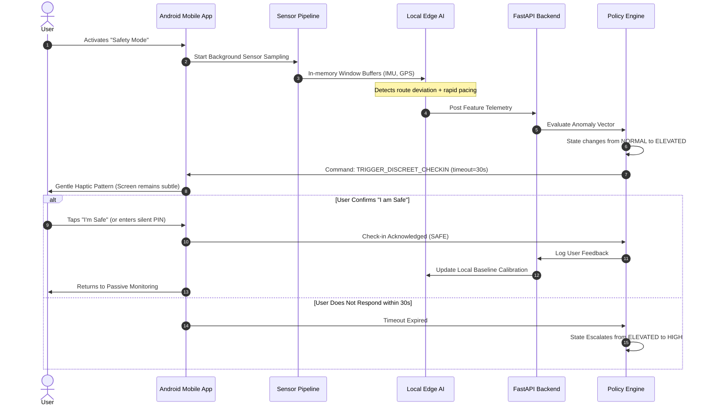
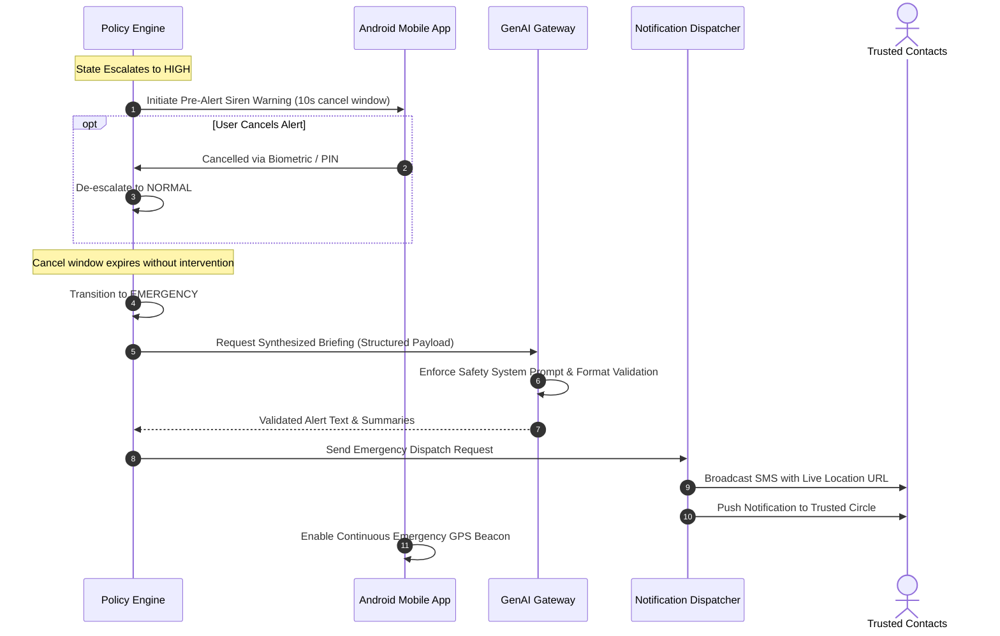
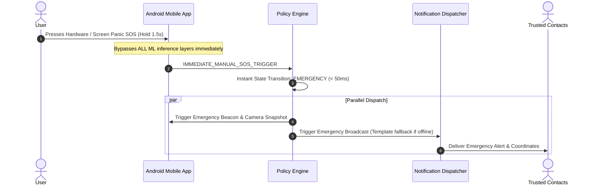

# WEGOTCHU: Component Interaction Patterns

## 1. System Interaction Scenarios

This document details runtime sequence flows, error recovery, and graceful degradation strategies across WEGOTCHU's edge mobile client, backend infrastructure, and external communication gateways.

---

## 2. Interaction Flow: Elevated Risk & Discreet Check-in

---

## 3. Interaction Flow: High Risk Escalation & Trusted Circle Alert

---

## 4. Interaction Flow: Inviolable Manual SOS Bypass

---

## 5. Offline Degradation & Fault Tolerance Strategies

| Failure Mode | Detection Indicator | Graceful Degradation Strategy |
| :--- | :--- | :--- |
| **Complete Network Loss (Offline)** | HTTP timeout / Socket disconnect | Android client runs standalone ONNX/LiteRT model on-device; if state reaches `HIGH`/`EMERGENCY`, triggers direct SMS via cellular carrier (no internet required). |
| **Degraded GPS Accuracy (> 50m)** | GPS `accuracy_meters` field | Fusion engine lowers GPS geospatial weighting and increases IMU cadence and pedometer dead-reckoning reliance. |
| **Low Battery (< 15%)** | Android BatteryManager | Sensor polling rate dynamically throttles (GPS drops from 1Hz to 0.1Hz; audio analysis interval increases from 1s to 5s). |
| **GenAI Service Failure / Timeout** | API timeout (> 5s) or HTTP 5xx | Policy Engine immediately falls back to deterministic rule-based template strings (`"EMERGENCY: User requires assistance at [Lat, Lon]."`). Emergency alerts are **never** blocked by LLM downtime. |
