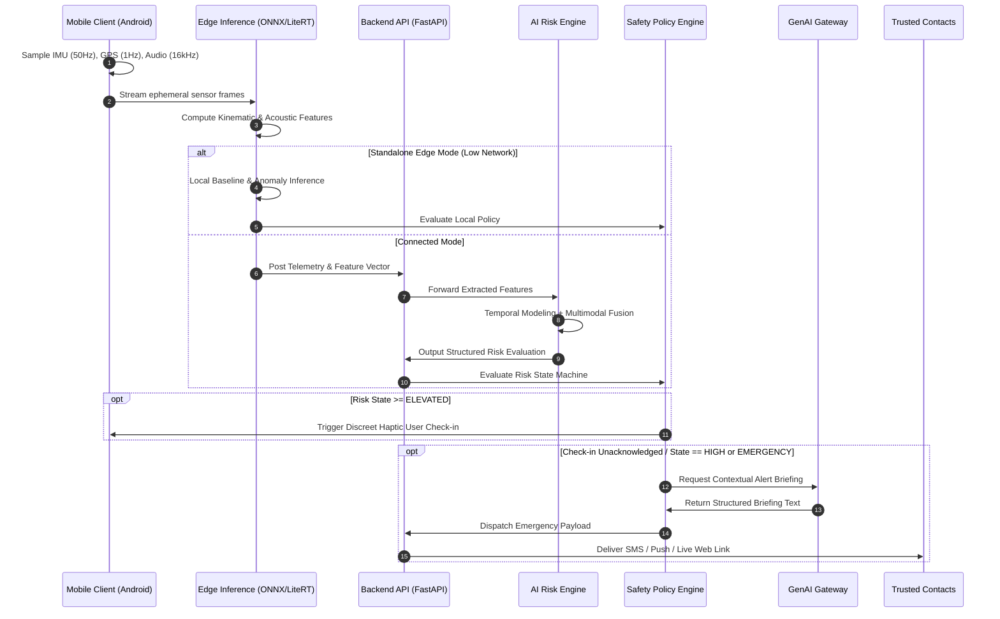

# WEGOTCHU: Data Flow & Interface Contracts (v0.1)

## 1. Specification Overview

This document specifies the communication interfaces, telemetry contracts, and schema definitions across the WEGOTCHU architecture. 

All contracts documented here are labeled **Version 0.1 (Draft Prototype)**. They are designed to evolve with semantic versioning as edge models and backend microservices mature.

---

## 2. End-to-End Data Pipeline Flow



---

## 3. Data Contracts (Version 0.1)

### Contract 1: Mobile Sensor Input Payload
*Emitted by mobile client to edge preprocessor or backend ingestion.*

```json
{
  "$schema": "https://json-schema.org/draft/2020-12/schema",
  "version": "0.1",
  "device_id": "usr_dev_a8f9c12b",
  "timestamp": "2026-09-11T23:14:00.000Z",
  "location": {
    "latitude": 37.774929,
    "longitude": -122.419416,
    "altitude_meters": 16.4,
    "accuracy_meters": 4.2
  },
  "speed_mps": 1.45,
  "bearing_degrees": 182.5,
  "accelerometer": {
    "x": 0.12,
    "y": 9.78,
    "z": 1.05
  },
  "gyroscope": {
    "x": 0.01,
    "y": -0.04,
    "z": 0.02
  },
  "battery_level": 0.68,
  "network_status": "CELLULAR_4G"
}
```

---

### Contract 2: Audio Perception Signal
*Emitted by local acoustic feature extractor.*

```json
{
  "$schema": "https://json-schema.org/draft/2020-12/schema",
  "version": "0.1",
  "timestamp": "2026-09-11T23:14:01.000Z",
  "window_duration_seconds": 1.0,
  "audio_distress_score": 0.74,
  "confidence": 0.82,
  "detected_class": "scream_distress",
  "ambient_noise_db": 68.5,
  "snr_db": 12.4
}
```

---

### Contract 3: Computer Vision Context Signal (P2)
*Emitted by optional scene context module.*

```json
{
  "$schema": "https://json-schema.org/draft/2020-12/schema",
  "version": "0.1",
  "timestamp": "2026-09-11T23:14:01.500Z",
  "ambient_lux": 1.8,
  "scene_type": "poorly_lit_outdoor",
  "estimated_crowd_density": "isolated",
  "optical_flow_magnitude": 0.08,
  "confidence": 0.79
}
```

---

### Contract 4: Fused AI Risk Engine Output
*Generated by Multimodal Fusion and Risk Engine.*

```json
{
  "$schema": "https://json-schema.org/draft/2020-12/schema",
  "version": "0.1",
  "user_id": "usr_9941a80c",
  "timestamp": "2026-09-11T23:14:02.120Z",
  "risk_level": "HIGH",
  "confidence": 0.89,
  "signals": [
    "route_deviation",
    "abnormal_motion",
    "audio_distress"
  ],
  "location_status": "available",
  "recommended_action": "USER_CHECK",
  "risk_vector": {
    "kinematic_anomaly": 0.84,
    "route_anomaly": 0.91,
    "acoustic_anomaly": 0.74,
    "temporal_persistence": 0.88
  }
}
```

---

### Contract 5: GenAI Emergency Briefing Request & Response
*Contract between Policy Engine and GenAI Communication Service.*

#### Request (To GenAI Service):
```json
{
  "user_first_name": "Alex",
  "risk_level": "HIGH",
  "confirmed_signals": ["route_deviation", "acoustic_distress"],
  "last_known_location": {
    "address_hint": "Near 4th & Market St",
    "latitude": 37.7858,
    "longitude": -122.4065,
    "maps_url": "https://maps.wegotchu.app/loc/x881f"
  },
  "elapsed_checkin_seconds": 45,
  "battery_percentage": 42
}
```

#### Response (Strict Structured Output):
```json
{
  "sms_alert": "WEGOTCHU ALERT: Alex hasn't responded to a safety check-in near 4th & Market St. Unplanned route change and loud distress sound detected. Battery: 42%. Live tracking: https://maps.wegotchu.app/loc/x881f",
  "push_notification_title": "Safety Alert: Alex Needs Attention",
  "push_notification_body": "Alex did not answer a safety check-in. Unusual movement and audio anomaly detected.",
  "situation_summary": "Alex's device registered an unexpected deviation from the regular commute route accompanied by acoustic distress indicators. A discreet check-in was triggered and remained unacknowledged for 45 seconds."
}
```
