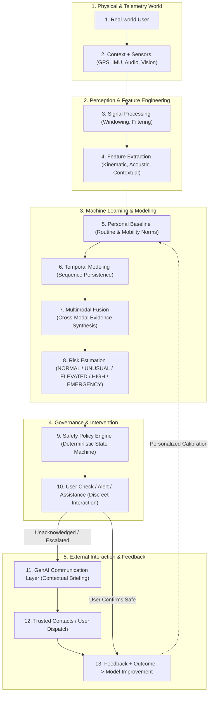

# WEGOTCHU: System Architecture Specification

## 1. Executive Architectural Philosophy

WEGOTCHU is designed from first principles as an **AI-powered proactive personal safety intelligence system**, fundamentally departing from conventional reactive SOS buttons. The architecture balances real-time edge responsiveness, user privacy, statistical anomaly detection, and deterministic safety governance.

A core tenet of this system is strict separation of concerns:
* **Perception** extracts objective sensory signals.
* **ML Inference** identifies statistical anomalies and temporal trends.
* **Risk Estimation** computes continuous, calibrated risk levels.
* **Safety Policy** deterministically governs interventions and escalation states.
* **GenAI Communication** synthesizes empathetic, clear human-readable alerts.

> [!CRITICAL]
> **The Generative AI (LLM) Boundary Principle:**  
> The Large Language Model (LLM) must **NEVER** be responsible for deciding whether a user is in danger or determining safety policy escalation. Danger assessment and policy escalation are strictly deterministic and rule-calibrated. The LLM functions purely as a communication and articulation synthesis layer.

---

## 2. End-to-End Conceptual Architecture (13-Tier Pipeline)

---

## 3. Comprehensive Layer-by-Layer Breakdown

### Layer 1: Real-World User
The individual navigating physical environments (e.g., walking home late at night, jogging in an unfamiliar park, commuting via rideshare). The user retains sovereign control, privacy consent toggles, and manual SOS override capability at all times.

### Layer 2: Context + Sensors
Mobile and wearable sensor collection:
* **Inertial Measurement Unit (IMU):** 3-axis Accelerometer, 3-axis Gyroscope, Magnetometer.
* **Geospatial & Mobility:** GPS coordinates, altitude, speed over ground, bearing, accuracy radius.
* **Acoustic Environment:** Ephemeral microphone audio buffers (sampled locally at 16 kHz).
* **Visual Context (P2):** Ambient illumination level, camera optical flow, high-level scene classification (when explicitly activated in Safety Mode).
* **Device Telemetry:** Battery level, network connectivity status, charging state, screen state.

### Layer 3: Signal Processing
Raw signal conditioning to isolate clean telemetry from physical noise:
* Bandpass filtering on IMU signals (0.5 Hz - 20 Hz) to separate body motion from gravity.
* Short-Time Fourier Transform (STFT) and Mel-frequency filterbanks for audio.
* Temporal sliding window segmentation (e.g., 2.56-second windows with 50% overlap for kinematics; 1-second audio frames).

### Layer 4: Feature Extraction
Domain-specific feature transformation:
* **Kinematics:** Root Mean Square (RMS), jerk, spectral energy, principal motion axis, step cadence.
* **Audio:** Mel-frequency cepstral coefficients (MFCCs), spectral flux, zero-crossing rate, pitch variance, acoustic distress energy.
* **Geospatial & Context:** Distance-to-known-route, corridor deviation score, speed variance, ambient light lux index, circadian hour index.

### Layer 5: Personal Baseline
Every individual has distinct behavioral norms. What is anomalous for one user (e.g., walking at 2:00 AM) may be standard for a shift worker:
* Maintains individualized statistical profiles (Gaussian Mixture Models / Kernel Density Estimation) over typical commute routes, average walking speed, and active hours.
* Compares incoming feature vectors against personal distributions to suppress false alarms.

### Layer 6: Temporal Modeling
Human safety dynamics evolve continuously. Isolated spikes (e.g., dropping a phone) are transient, whereas genuine safety risks exhibit sustained temporal trends:
* Uses sequential architectures (Recurrent Neural Networks, GRU, Temporal Convolutional Networks, or lightweight Transformers).
* Evaluates temporal persistence, transition probabilities, and sequence consistency over sliding multi-minute horizons.

### Layer 7: Multimodal Fusion
Heterogeneous modality synthesis:
* Combines motion kinematics, geospatial context, and acoustic distress indicators.
* Utilizes a hybrid/late fusion strategy weighted by modality confidence and sensor noise margins.
* Ensures that a single noisy sensor cannot trigger a catastrophic false escalation.

### Layer 8: Risk Estimation
Calculates an explicit, calibrated risk vector:
* Evaluates likelihood scores mapped into 5 standardized risk estimation states: `NORMAL`, `UNUSUAL`, `ELEVATED`, `HIGH`, and `EMERGENCY`.
* Generates confidence calibration metrics (e.g., temperature-scaled probabilities).

### Layer 9: Safety Policy Engine
A strictly deterministic, rule-based state machine:
* Acts as the inviolable gatekeeper between ML risk predictions and real-world actions.
* Implements hysteresis timers (e.g., an elevated state must persist for $T_{	ext{elevated}}$ seconds or exceed threshold $	heta$ before triggering user check-in).
* Prevents runaway model hallucinations or false escalations.

### Layer 10: User Check / Alert / Assistance
Graduated human-computer interaction:
* **Discreet Check-in:** Silent haptic pulse or subtle notification asking "Are you okay?" with a countdown timer.
* **Safety Assistance:** Brightening screen flashlight, path navigation guidance to safe zones.
* **Pre-escalation Countdown:** Visible and audible timer giving the user ample time to cancel false alarms.

### Layer 11: GenAI Communication Layer
When policy dictates that trusted contacts or emergency responders must be notified:
* Synthesizes dynamic, natural-language briefings from structured risk data.
* Summarizes route progress, nature of anomaly (e.g., unexpected stop, deviation from transit corridor), last confirmed location, and battery level.
* Strictly bounded by system prompts: cannot hallucinate facts, invent details, or change risk status.

### Layer 12: Trusted Contacts / User Dispatch
Omni-channel alert delivery:
* Sends SMS, push notifications, and live-tracking web links to user-configured trusted circles.
* In full emergency escalation (with user consent), interfaces with local emergency services or institutional campus security.

### Layer 13: Feedback + Outcome -> Model Improvement
Continuous closed-loop learning:
* User tags alerts ("False Alarm - I was running for a bus" or "Correct Alert").
* Updates local personal baseline weights on-device.
* Preserves user privacy: raw data is not harvested; only edge parameter updates or synthetic error profiles are retained.

---

## 4. Architectural Segregation & Safety Isolation Matrix

| Component | Responsibility Domain | Primary Tech | Execution Environment | Safety Authority |
| :--- | :--- | :--- | :--- | :--- |
| **Perception** | Raw signal capture & noise reduction | Kotlin, C++, Torchaudio, OpenCV | On-Device (Edge) | None (Data provider) |
| **ML Inference** | Pattern recognition & sequence scoring | PyTorch, ONNX Runtime, TFLite | On-Device / Backend | Probabilistic (Scores only) |
| **Risk Engine** | Multimodal risk state calculation | Python / Scikit-learn / PyTorch | Edge / Backend | Advisory (State vector) |
| **Safety Policy** | Escalation rules, timers, triggers | Deterministic State Machine (Python/Kotlin) | Edge / Backend | **AUTHORITATIVE** |
| **GenAI** | Contextual alert synthesis & messaging | LLM via JSON Schema Structured Output | Backend Gateway | Communicative only (**NO AUTHORITY**) |

---

## 5. Architectural Non-Negotiables

1. **Deterministic Override Supremacy:** If the safety policy or manual SOS demands an alert, no AI model can block it.
2. **Manual SOS Bypass:** Manual SOS activates an immediate transition to `EMERGENCY` state in $< 100$ milliseconds, bypassing all intermediate ML inference layers.
3. **Graceful Degradation:** If network connectivity drops or the cloud backend is unreachable, the on-device edge engine must maintain standalone anomaly detection, local haptic alerts, and SMS fallback.
